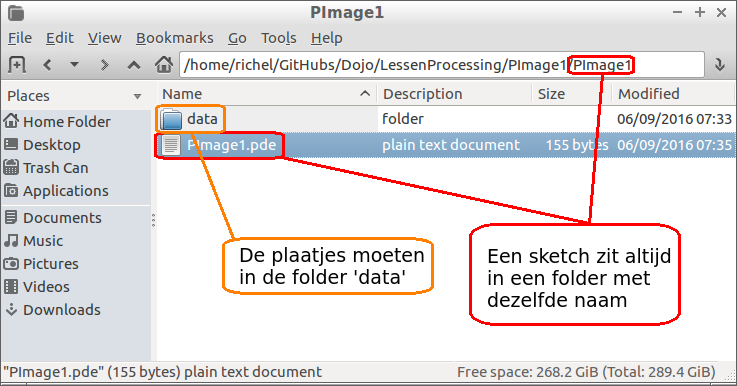

# `PImage`

In deze les gaan we met plaatjes werken!


## Opdracht 1

Save deze code. Run deze code. Wat zie je?
   
```c++
PImage plaatje;

void setup() 
{
  size(640, 360);
  plaatje = loadImage("mario.png");
}

void draw() 
{
  background(255, 255, 255);
  image(plaatje, 100, 200);
}
```

## Oplossing 1

Je krijgt een error!


 | De computer zegt dat hij het plaatje niet kan vinden!
:-------------:|:----------------------------------------: 

## Opdracht 2

Ga naar [https://github.com/richelbilderbeek/Dojo/blob/master/LessenProcessing/PImage/mario.png](https://github.com/richelbilderbeek/Dojo/blob/master/LessenProcessing/PImage/mario.png)
en download dit plaatje van Mario. 


Stop dit plaatje in een subfolder van waar je code staat.

Hier zie je een plaatje waarop staat waar de bestanden moeten staan:



 * De sketch heet `PImage1.pde`. Daarom staat deze in de map `PImage1`. Deze kan je in Processing vinden onder `Schets` -> `Toon Schets Map`
 * De sketch heeft een folder `data`. Hierin staat het plaatje, `mario.png`

## Eindopdracht


Maak het programma full-screen, maak de achtergrond groen en zet het plaatje in het midden.


