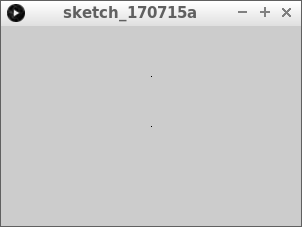
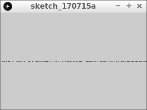
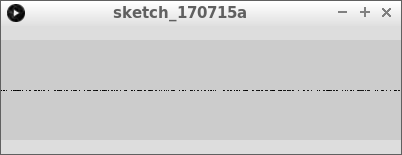

# `point`

In deze les gaan we leren 

 * wat pixels zijn
 * hoe de pixels op een beeldscherm zitten
 * hoe je puntjes tekent

## Pixels

Pixels zijn de vierkantjes waaruit je beeldscherm is opgebouwd.

 | Pixel = een vierkantje op je beeldscherm
:-------------:|:----------------------------------------: 

Hoe meer pixels je scherm heeft, hoe scherper het beeld eruit ziet.
Dat zie je goed bij oude games: die hebben minder pixels:

</img>

## Opdracht 1

## Opdracht 1

Run de volgende code:

```c++
void setup()
{
  size(300, 200);
}

void draw()
{
  point(150, 100);
}
```

 | 
:-------------:|:----------------------------------------: 
`point(150, 100);`|'Lieve computer, teken een puntje op de pixel die tweehonderd pixels naar rechts en honderdvijftig pixels omlaag is'
`point(150, 100);`|'Lieve computer, teken een puntje op coordinaat `(150, 100)`'

# Oplossing 1


## Opdracht 2



Teken een tweede puntje tussen de eerste en de bovenkant van het venster.

## Oplossing 2

```c++
void setup()
{
  size(300, 200);
}

void draw()
{
  point(150, 100);
  point(150, 50);
}
```

## Opdracht 3

De eerste pixel zit precies in het midden. Oftewel op de helft van de breedte van het venster en
op de helft van de hoogte van het scherm. Verander `point(150,100);` naar iets met `width` en `height`.

## Oplossing 3

```c++
void setup()
{
  size(300, 200);
}

void draw()
{
  point(width / 2, height / 2);
  point(150, 50);
}
```

 | 
:-------------:|:----------------------------------------: 
`width / 2`|'Lieve computer, vul hier de breedte van het venster in, gedeeld door twee'

## Opdracht 4

De tweede pixel zit 

  * op de helft van de breedte van het venster
  * op een kwart van de hoogte van het scherm

Verander `point(150, 50);` naar iets met `width` en `height`.

## Oplossing 3

```c++
void setup()
{
  size(300, 200);
}

void draw()
{
  point(width / 2, height / 2);
  point(width / 2, height / 4);
}
```

 | 
:-------------:|:----------------------------------------: 
`height / 4`|'Lieve computer, vul hier de hoogte van het venster in, gedeeld door vier'


## Opdracht 4


Teken een nieuwe pixel, in de linkerbovenhoek van het scherm. 

## Oplossing 4

```
void setup()
{
  size(300, 200);
}

void draw()
{
  point(width / 2, height / 2);
  point(width / 2, height / 4);
  point(0, 0);
}
```

 | 
:-------------:|:----------------------------------------: 
`point(0,0);`|'Lieve computer, teken een puntje in de linkerbovenhoek'
`point(0,0);`|'Lieve computer, teken een puntje op coordinaat `(0, 0)`'

## Opdracht 5


Teken een nieuwe pixel, in de rechtbovenhoek van het scherm. 
Gebruik `width - 1` als eerste getal binnen de ronde haakjes van `point`.

## Oplossing 5

```c++
void setup()
{
  size(300, 200);
}

void draw()
{
  point(width / 2, height / 2);
  point(width / 2, height / 4);
  point(0, 0);
  point(width - 1, 0);
}
``` 

## Opdracht 6


Teken twee pixels erbij, in de onderste twee hoeken. Gebruik `width - 1` en `height - 1` op de juiste plekken.

## Oplossing 6

```c++
void setup()
{
  size(300, 200);
}

void draw()
{
  point(width / 2, height / 2);
  point(width / 2, height / 4);
  point(0, 0);
  point(width - 1, 0);
  point(0, height - 1);
  point(width - 1, height - 1);
}
```

## Opdracht 7

Run deze code:

```c++
void setup()
{
  size(300, 200);
}

void draw()
{
  point(random(300), 100);
}
```

Wat zie je?

## Oplossing 7



Je ziet dat er puntjes op willekeurige plekken worden getekend, maar wel altijd op dezelfde hoogte.

 | 
:-------------:|:----------------------------------------: 
`random(300)`|'Lieve computer, kies een willekeurig getal van nul tot driehonderd'

## Opdracht 8



Maak het venster 400 pixels breed en 100 pixels hoog. Gebruik in plaats van `random(300)` iets met `random` en `width`.
Zorg dat de lijn van puntjes op de halve hoogte van het scherm blijft.

## Oplossing 8

```c++
void setup()
{
  size(400, 100);
}

void draw()
{
  point(random(width), height / 2);
}
```

## Eindopdracht


Laat de computer willekeurig puntjes tekenen in het hele venster.