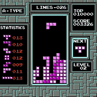
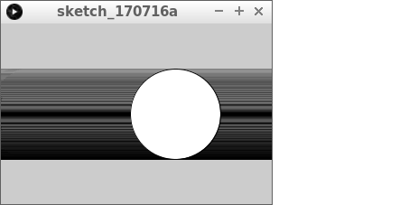
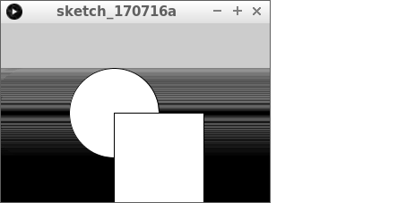
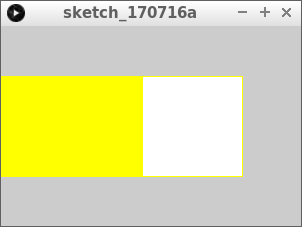
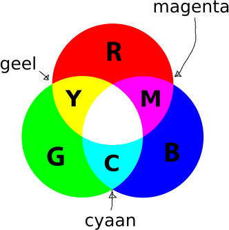

# `rect`

Vierkanten worden veel gebruikt in games.

Hier zie je een van de beroemdste games ooit:



Je kunt een vierkant tekenen met vier lijnen,
maar de `rect` functie werkt gemakkelijker.

## Opdracht 1

Run deze code

```
float x = -50;

void setup()
{
  size(300, 200);
}

void draw()
{
  ellipse(x, height / 2, 100, 100);
  x = x + 1;
  if (x > width + 50)
  {
    x = -50;
  }
}
```

## Oplossing 1



## Opdracht 2

Voeg de volgende extra regel toe, na `ellipse(x, height / 2, 100, 100);`:

```c++
  rect(x, height / 2, 100, 100);
```

## Oplossing 2



```
float x = -50;

void setup()
{
  size(300, 200);
}

void draw()
{
  ellipse(x, height / 2, 100, 100);
  rect(x, height / 2, 100, 100);
  x = x + 1;
  if (x > width + 50)
  {
    x = -50;
  }
}
```

 | 
:------------------------:|:---------------------------------------------------: 
`rect(100, 200, 300, 400)`|'Lieve computer, teken een rechthoek met `(100, 200)` als linkerbovenhoek, 300 pixels breed en 400 pixels hoog is.'

## Opdracht 3


Teken de rechthoek nu over de ovaal. Doe dit door van de `x` en `y` coordinaat 50 af te halen.

## Oplossing 3

```c++
float x = -50;

void setup()
{
  size(300, 200);
}

void draw()
{
  ellipse(x, height / 2, 100, 100);
  rect(x - 50, height / 2 - 50, 100, 100);
  x = x + 1;
  if (x > width + 50)
  {
    x = -50;
  }
}
```

## Opdracht 4



Haal de onzichttbare ovaal weg en maak de lijnkleur geel. Hoe je geel maakt,
kun je zien in figuur `Kleurencirkel`.



## Oplossing 4

```c++
float x = -50;

void setup()
{
  size(300, 200);
}

void draw()
{
  stroke(255, 255, 0);
  rect(x - 50, height / 2 - 50, 100, 100);
  x = x + 1;
  if (x > width + 50)
  {
    x = -50;
  }
}
```

## Opdracht 5

Voeg de volgende regel toe na `stroke(255, 255, 0);`:

```c++
fill(x, 0, 255);
```

## Oplossing


```c++
float x = -50;

void setup()
{
  size(300, 200);
}

void draw()
{
  stroke(255, 255, 0);
  fill(x, 0, 255);
  rect(x - 50, height / 2 - 50, 100, 100);
  x = x + 1;
  if (x > width + 50)
  {
    x = -50;
  }
}
```

 | 
:----------------:|:----------------------------------------: 
`fill(0, 128, 255);`|'Lieve computer, maak de invulkleur zonder rood, halvol groen en vol blauw.'

## Opdracht 6

Maak een nieuwe variable aan, `groen` met een beginwaarde van nul. 
`groen` wordt gebruikt als het tweede getal van `fill` (inplaats van de nul).
Elke keer wordt `groen` twee hoger.

### Oplossing 6

```c++
float x = -50;
float groen = 0;

void setup()
{
  size(300, 200);
}

void draw()
{
  stroke(255, 255, 0);
  fill(x, groen, 255);
  rect(x - 50, height / 2 - 50, 100, 100);
  x = x + 1;
  groen = groen + 2;
  if (x > width + 50)
  {
    x = -50;
  }
}
```
 
## Opdracht 7


De variabele `groen` mag niet hoger worden dan `255`. Maak een `if` erbij,
dat als `groen` meer is dan 255, dat groen dan nul wordt

## Oplossing 7

```c++
float x = -50;
float groen = 0;

void setup()
{
  size(300, 200);
}

void draw()
{
  stroke(255, 255, 0);
  fill(x, groen, 255);
  rect(x - 50, height / 2 - 50, 100, 100);
  x = x + 1;
  groen = groen + 2;
  if (x > width + 50)
  {
    x = -50;
  }
  if (groen > 255)
  {
    groen = 0;
  }
}
```

## Opdracht 8


Maak de blauwheid van de invulkleur een willekeurig getal van nul tot 256.

## Oplossing 8

```c++
float x = -50;
float groen = 0;

void setup()
{
  size(300, 200);
}

void draw()
{
  stroke(255, 255, 0);
  fill(x, groen, random(256));
  rect(x - 50, height / 2 - 50, 100, 100);
  x = x + 1;
  groen = groen + 2;
  if (x > width + 50)
  {
    x = -50;
  }
  if (groen > 255)
  {
    groen = 0;
  }
}
```

## Eindopdracht


Maak de lijnkleur willekeurig in roodheid (dus van zwart tot rood, groen en blauw zijn uit).
Laat de invulkleur gaan van zwart naar groen, waarbij groen steeds 3 hoger wordt.
