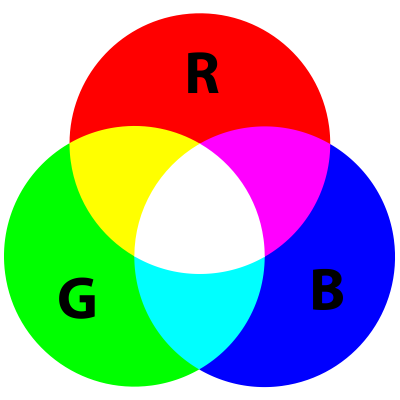

# `stroke`

Zonder kleur zien games er minder mooi uit.

Een van de allereerste games met kleur heette Moria:


In deze les gaan we leren 

 * hoe je een lijn een kleur kan geven.

Zo gaat het eruit zien:


Weet je nog niet hoe kleuren werken,
ga dan naar de les 
[background](../Background/README.md)

## Een lijnkleur instellen



In Processing is er een functie om lijnen een kleur te geven.
Deze functie heet `stroke`.
`stroke` is Engels voor '(penseel)streek'.
`stroke` is een functie die drie getallen nodig heeft.
Deze drie getallen zijn de RGB waarden.

Met deze Processing code krijg je een rode lijn:

```c++
void setup()
{
  size(100,100);
}

void draw()
{
  stroke(255,0,0);
  line(10,20,30,40);
}
```

Met `stroke` zeg je: 'vanaf nu wil ik deze lijnkleur'.
Hieronder zie je hoe je twee groene en een blauwe lijn tekent:

```c++
void setup()
{
  size(100,100);
}

void draw()
{
  stroke(0,255,0);
  line(10,20,30,40);
  line(50,60,70,80);
  stroke(0,0,255);
  line(90,10,20,30);
}
```

## Opdracht


 * 1. Maak in Processing bovenstaande tekening na. Het venster is honderd bij honderd pixels. 
   Elke kleur is met twee lijnen getekend.
   De kleuren zijn rood, geel, groen, cyaan, blauw, magenta 

## Oplossing

```c++
void setup()
{
  size(100,100);
}

void draw()
{
  stroke(255,0,0);
  line(0,0,0,100);
  line(1,0,1,100);
  stroke(255,255,0);
  line(2,0,2,100);
  line(3,0,3,100);
  stroke(0,255,0);
  line(4,0,4,100);
  line(5,0,5,100);
  stroke(0,255,255);
  line(6,0,6,100);
  line(7,0,7,100);
  stroke(0,0,255);
  line(8,0,8,100);
  line(9,0,9,100);
  stroke(255,0,0);
  line(10,0,10,100);
  line(11,0,11,100);
}
```

##Eindopdracht

Maak nog vier kleuren bij het voorbeeld hierboven.
