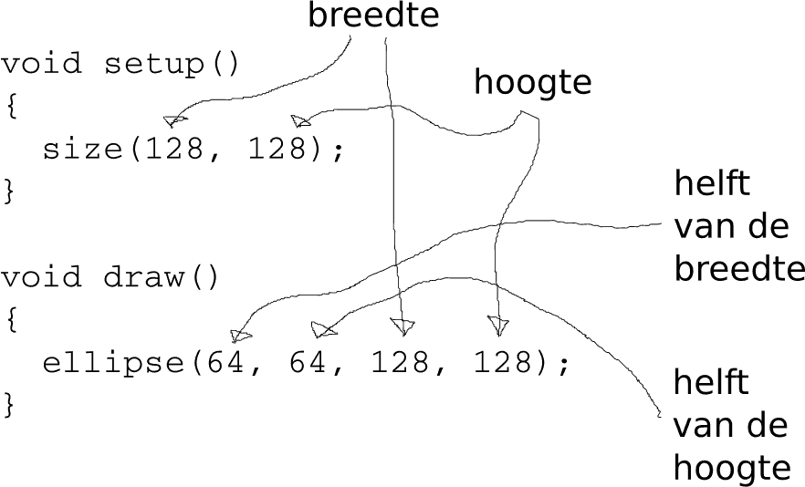
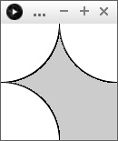

# `width` en `height`

In deze les leer je hoe handig `width` en `height zijn`

## Intro

```c++
void setup() 
{
  size(256, 256);
}

void draw()
{
  ellipse(128, 128, 256, 256);  
}
```

 | 
:---------------------:|:----------------------------------------: 
`size(800, 400);`|'Lieve computer, maak een venster van 800 pixels wijd en 400 pixels hoog.'
`ellipse(60,50,40,30);`|'Lieve computer, teken een ovaal `60` pixels naar rechts, 50 pixels omlaag, die 40 pixels wijd en 30 pixels hoog is.'

## Opdracht 1

Type bovenstaande code over en run deze.

## Oplossing 1


## Opdracht 2


Maak het venster nu 128 bij 128 pixels klein.

## Oplossing

```c++
void setup() 
{
  size(128, 128);
}

void draw()
{
  ellipse(64, 64, 128, 128);  
}
```

## `width` en `height`


`width` en `height` zijn ingebouwd in Processing, 
zodat je programma nog werkt als je de grootte van je scherm aanpast.

Nu werken onze programma's alleen voor een scherm van een bepaalde grootte. 
Dan moet je elke keer als je een nieuwe grootte kiest, een heleboel code opnieuw typen!

Als we de breedte en hoogte van het scherm weten, weten we ook welke getallen in `ellipse` moeten:

 * de x coordinaat van de ovaal is de helft van de breedte 
 * de y coordinaat van de ovaal is de helft van de hoogte
 * de breedte van de ovaal is de breedte van het scherm
 * de hoogte van de ovaal is de hoogte van het scherm



Processing weet de breedte en hoogte van het scherm:
De breedte van het scherm heet `width` en de hoogte heet `height`

 | 
:-------------:|:----------------------------------------: 
`width`|'Lieve computer, vul hier in hoeveel pixels het venster breed is.'
`height`|'Lieve computer, vul hier in hoeveel pixels het venster breed is.'

Deze getallen worden bepaald zodra je size gebruikt om de grootte van je scherm te defineren.

\pagebreak

## Opdracht 3


Maak een programma wat een ovaal tekent die het scherm opvult:

 * Verander de eerste `64` in `width / 2`
 * Verander de tweede `64` in `height / 2`
 * Verander de eerste `128` in `width`.
 * Verander de tweede `128` in `height`.

 | 
:-------------:|:----------------------------------------: 
`/`|'gedeeld door', een deelstreep zoals je ook bij breuken hebt, `:`

## Oplossing 3


```c++
void setup() 
{
  size(128, 128);
}

void draw()
{
  ellipse(width / 2, height / 2, width, height);  
}
```

## Opdracht 4


Zet het middelpunt van de cirkel op coordinaat `(0, 0)`.

\pagebreak

## Oplossing 4

```c++
void setup() 
{
  size(128, 128);
}

void draw()
{
  ellipse(0, 0, width, height);  
}
```

## Opdracht 5


Maak een tweede cirkel die als middelpunt de rechterbovenhoek heeft.
Gebruik `width` en/of `height`.

\pagebreak

## Oplossing 5

```c++
void setup() 
{
  size(128, 128);
}

void draw()
{
  ellipse(0, 0, width, height);  
  ellipse(width, 0, width, height);  
}
```

## Opdracht 6



Maak een derde cirkel die als middelpunt de linkeronderhoek heeft.
Gebruik `width` en/of `height`.

## Oplossing 6

```c++
void setup() 
{
  size(128, 128);
}

void draw()
{
  ellipse(0, 0, width, height);  
  ellipse(width, 0, width, height);  
  ellipse(0, height, width, height);  
}
```

\pagebreak

## Eindopdracht


 * Maak het venster 300 pixels breed en 200 pixels hoog
 * Maak een vierde cirkel die als middelpunt de rechteronderhoek heeft
 * Maak een vijfde cirkel die in het midden staat en twee keer zo klein is

## Links

 * [YouTube video 'Width en Height'](https://youtu.be/pbj0fUn0qVQ)
 * [mp4](http://www.richelbilderbeek/width_en_height.mp4)